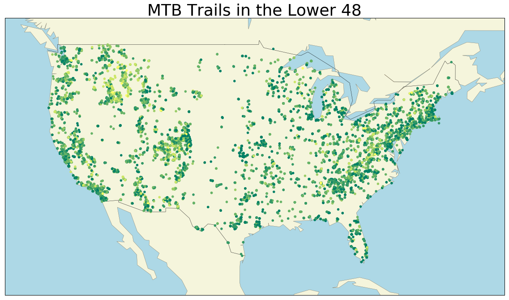
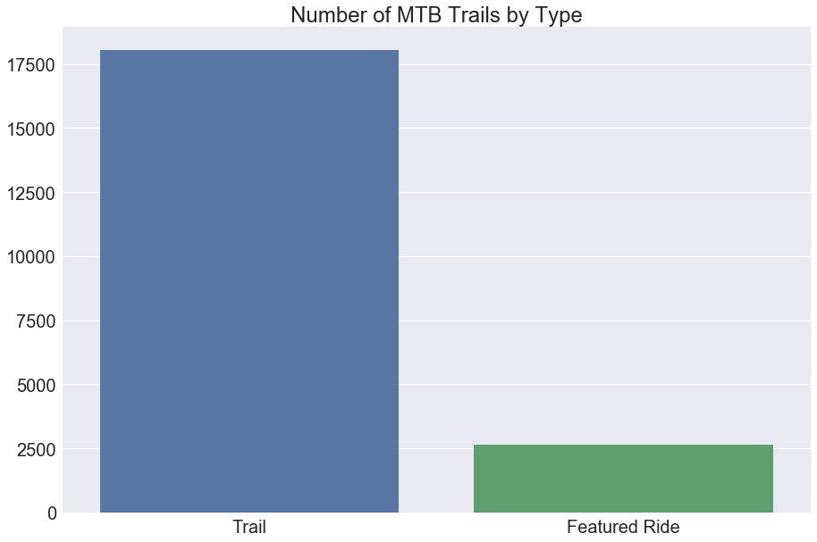
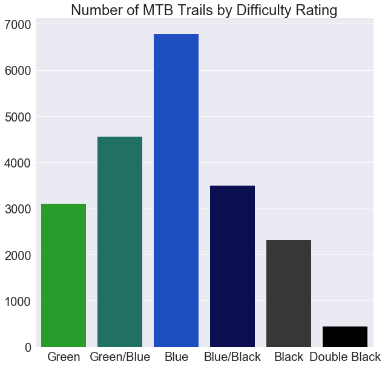
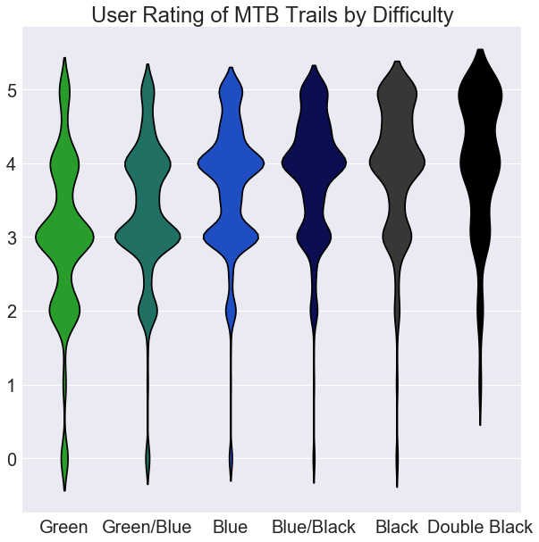
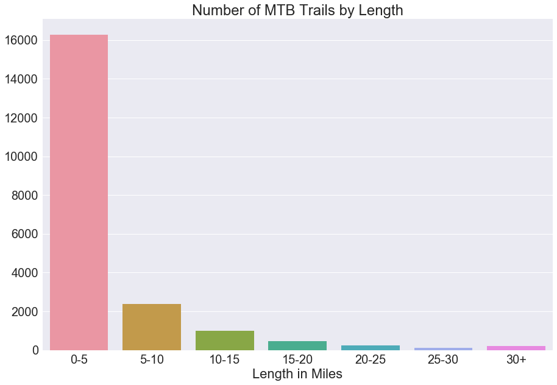
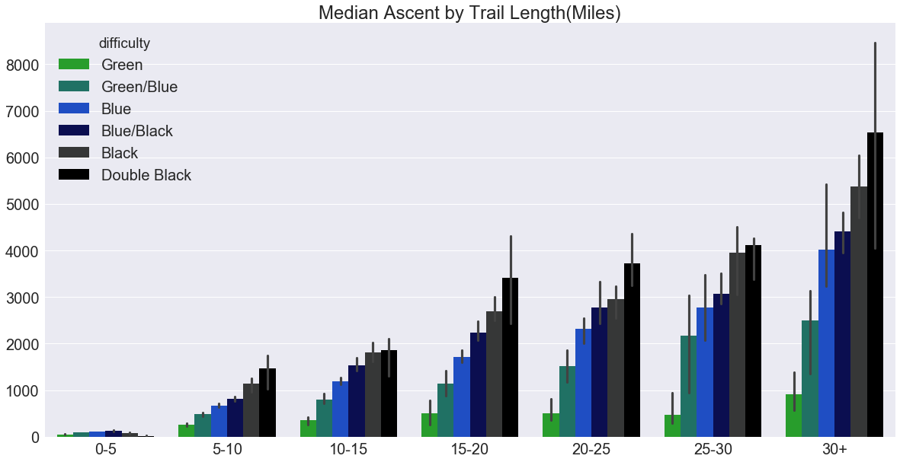
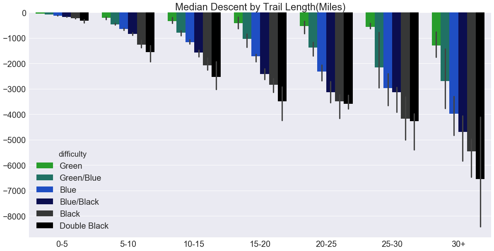
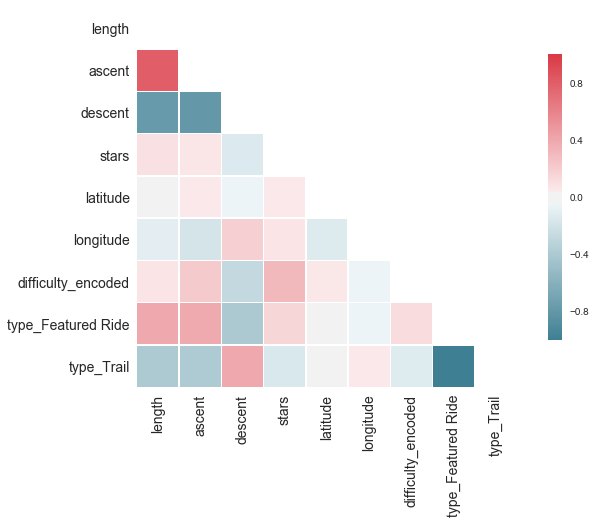

# www.mtbtrailfinder.com: A Mountain Bike Trail Finder

## Motivation

As a mountain biker, whether you’ve been riding for years or just starting out,
you’re always looking for the next trail to shred.  It’s easiest to get recommendations from other riders in the parking lot of your favorite trail, but you can also ask around at local bike shops, Facebook or Meetup groups for mountain bikers, and websites such as [MTBProject](https://www.mtbproject.com).  
Still, when being told that a ride unknown to you is “totally epic”, you wonder,
“Will it be fast and flowy or more rocky and technical?  Are there lots of drops
and if so, can I roll them?  Is it mostly climbing, descending, or an equal amount
of both? Is it an out and back, loop, lollipop, or do I need a shuttle? If it’s going to be a long day in the saddle, are there bailouts just in case?”  MTBProject.com doe a good job of answering these questions for you when you search
for the stats of a specific trail,

such as Lair O' the Bear, but wouldn’t it be nice if you could get a recommendation based on the trails you know and like?  Or if you know you want a new ride that’s a certain length, within a certain distance of where you are, and a certain level of technicality, what should you ride?  Whether you’ve ridden all the trails in your area and are looking for a new one, or are headed to Durango for a weekend and looking for some downhill shuttled rides, www.mtbtrailfinder.com has the perfect ride tailored to your desires.

## Data

I wrote python code that made enough requests to [MTB Project's API](https://www.mtbproject.com//data) to get
data on 26,752 trails in all 50 states and the nation's capital.  The API data came
in JSON files, which were very easy to access, put into pandas dataframes, and concat. The raw features were:
* 'ascent'
* 'conditionDate'
* 'conditionDetails'
* 'conditionStatus'
* 'descent'
* 'difficulty'
* 'high'
* 'id'
* 'imgMedium'
* 'imgSmall'
* 'imgSmallMed'
* 'imgSqSmall'
* 'latitude'
* 'length'
* 'location'
* 'longitude'
* 'low'
* 'name'
* 'starVotes'
* 'stars'
* 'summary'
* 'type'
* 'url'  

## Feature Engineering

Since I want to build a content-recommender that will compare trails on their features, I dropped:
* 'conditionDate'
* 'conditionDetails'
* 'conditionStatus'
* 'high'
* 'id'
* 'imgMedium'
* 'imgSmall'
* 'imgSmallMed'
* 'imgSqSmall'
* 'low'

since I didn't believe those features, even the images, are the best indicators of what makes trails similar.  I didn't end up using all the remaining features, such as 'latitude', 'longitude', 'summary', and 'url', to make my comparisons but I kept them as I would need them in my website; I also created a few new columns for 'city/town' and 'state' so that I could later search the trails by state and/or location.  I found 5,804 trails were of the type 'Connector', which is a trail that is most likely less than 1 mile long and intended as a bypass or connection between trails or trail systems; therefore I didn't think it desirable to recommend them as trails to ride on.  I also dropped the 37 trails that had missing difficulty ratings, as this would be an attribute I would use for comparison of trails.  Knowing that riders would prefer to see a set of trails with a specific range of distances, I created a length_range column that categorized each trail within a certain distance range.  In order to make the comparisons, I needed to quantify all features that I planned to use so I encoded 'difficulty', and created dummy variable columns for 'type'.  Lastly, I cleaned up columns with string values to make them more presentable for visualizations and the website.  

## Exploratory Data Analysis through Visualizations and Maps

Populating all the trails by their lat/lon and coloring them by their difficulty level, you can see that while there are trails all over the country, the midwest seems pretty sparse.  The data is submitted by riders; therefore the app may not be as popular in the midwest and/or mountain biking is not as popular.

According to [MTB Project's FAQ](https://www.mtbproject.com/faq), "a trail is a single trail, while a featured ride might include parts or all of several trails and maybe even portions of road to connect them. Featured rides are the best or most popular routes in a given area; they are the recommended way to use trails indicating the direction of travel and where to start and finish."  As a rider, rarely do you ever just ride one trail as a trail system almost always has numerous trails from which to make connected routes and loops.  Featured rides are therefore what I'd prefer to recommend, but as you can see, there are many more trails than featured rides.  This is simply because not enough users have uploaded their featured rides and shows that MTB Project could increase their number of offered featured rides by giving incentives to users to upload their own connections of trails.

We see here that out of the six difficulty levels, most trails are labeled as blue, green/blue, or blue/black.  This is most likely because blue-ish trails are ridden by the average rider; in order to build a trail that will be popular, trail builders make sure it is accessible by the average rider, while also having some challenging features for the more advanced riders.

These violin plots show that green trails are the most unrated and poorly rated of trails. It's interesting to see that as the difficulty level increases, so does the average rating; one can imagine that advanced riders are most likely the only ones attempting the double black trails and therefore rate them highly because of the challenge they give.  This graph also suggests that collaborative filtering would help to recommend trails to users who like the same trails, but the data on trail ratings per user is so parse that it would be hard to make an accurate collaborative filtering recommender.  Again, MTBProject could give incentives to users in order to increase their number of ratings in order to gain more knowledge about each user.

This graph shows that trails that are between 0 and 5 miles long overwhelmingly dominate the number of trails on MTBProject.  This relates back to the greater number of trails versus featured rides, where trails are singular trails, usually shorter than a few miles, and featured rides are connected trails.  

These two graphs hint at the fact that the biggest factor in determining the difficulty of a trail is not the length, but rather the ascent and descent.  For every length range, as the difficulty increases, the ascent and descent increases.  Trails with a lot of climbing or a lot of descending demand a higher level of physical fitness, which may be why they are rated higher, though they also most likely have more technical features since rocks and roots stabilize trails with high grades to make them rideable.  This graph suggests more research should be done to categorize technical features and count them in order to see if there is a posiitive correlation between ascent/descent and number of technical features.  

This heatmap shows that the most strongly correlated quantitative columns of my data are length and ascent/descent.  This makes sense because as a trail gets longer, it increases in ascent/descent, unless it is a flat jeep road.  Overall, looking for the darker red and blue boxes, the features most highly correlated with each other are length, ascent, descent, difficulty, stars(which are the trail's rating), and type of trail.  The three types of trails are Connectors, Trails, and Featured Rides.  I dropped all Connectors earlier because they only meant to connect trails and different trail systems; they are not intended nor made to be a main part of any ride.  A trail is simply a single trail, while a featured ride is a connection of trails.  For example, at the Green Mountain trail system in Lakewood, Colorado, the Summit Loop is a trail, while the Summit Loop connected to the Box O' Rox trail connected to the Rooney Valley trail is a featured ride.  

## Methods

### Content Based Recommender

As I mentioned in motivation, the question that most riders want to know about an unknown trail is, "What trails have I ridden are like this new one?"; therefore I knew that I wanted to build a recommender that would take a trail known to a rider and return all the trails in the country ordered by their similarity to the known trail.  The rider would then have the option of filtering the set of trails by state and city/town depending on where they would like to ride.  The columns I chose to compare for similarity are:
* 'ascent'
* 'descent'
* 'difficulty_encoded'
* 'length'
* 'stars'
* 'type_Featured Ride'
* 'type_Trail'

as these are the traits that are most highly correlated according to my heatmap and logically define a rider's experience and preference for a trail.  

Let's take a look at three popular trails in Colorado's Front Range:

Name | Difficulty | Length | Ascent | Descent | Stars | Featured Ride | Trail
--- | --- | --- | --- | --- | --- | --- | ---
*Betasso* | 2 | 7.4 | 829 | -829 | 3.9 | 1 | 0
*Marshall* | 2 | 10.3 | 960 | -961 | 3.6 | 1 | 0
*Apex Park* | 4 | 9.4 | 1668 | -1667 | 4.4 | 1 | 0

ADD IN THE ACTUAL COLUMNS AND DATA FOR BETASSO PRESERVE, MARSHALL MESA, AND APEX PARK

These features have different ranges in their values and different units of measurement; for example a difference of three miles in length between two trails is different than a difference of three feet in ascent; therefore I scaled each feature value by subtracting it by the feature's mean and then dividing that difference by the feature's standard deviation. I did this so that the magnitude of certain features would not have too much influence on a measurement of similarity and so that differences in units would no longer matter.  I chose not to include latitude and longitude in my features used for comparison since both of my recommenders will have an option to filter based on state and city/town or radius from a current location.  

Considering each trail and it's features as a vector, I wanted to be able to measure the similarity of any one vector to all the other vectors.  Cosine Similarity and Euclidean Distance are two popular methods to measure vector similarity; I chose Cosine Similarity to measure the similarity between my vectors because it measures the angle, or direction, between the vectors without taking the magnitude of the vectors into consideration.  In essence, it measures the ratio of the trails' features, instead of how big or small those features are.  I wanted my metric to prioritize how similar trails are in terms of their ratios, instead of just how close their values are.  

### Cold Start Recommender Based on Location

As a rider, your decision on where to ride is often based on how much time you have.  The time you have depends on the time it takes to get your bike ready, put all your gear on, drive to the trail, ride, drive home, and then unpack your bike and gear.  Most riders are looking to ride 1 - 3 hours, with driving distance to the trailhead often being the biggest deciding factor in where to ride.  Since distance between two locations is easy to calculate using Python's GeoPy library, I decided to create a recommender to suggest trails based off their driving distance from the user's current location.  I started simply by creating a function that would take in an address and a maximum desired distance to drive from that location; it turns the address into a lat/lon location using Google's API, and then converts the maximum desired distance into a longitude difference and a latitude difference(miles per degree in latitude changes with longitude so I had to make sure my function accounted for this).  I then used those differences to get latitude and longitude ranges and I returned to the user all trails whose latitude and longitude were within that range.  I made it possible for the user to filter the returned recommendations based on distance length ranges(0-5, 5-10, 10-15, 15-20, 20-25, 25-30, or 30+), and the difficulty level(green, blue, or black trails).  I'm extremely satisfied with the results as it returns rides I've never ridden and never knew were so close to me.  

## Website

## Future Direction

## Tech Stack
